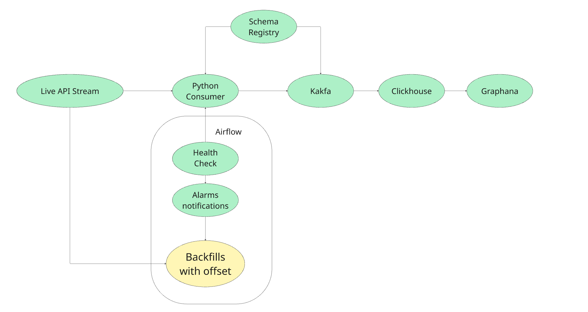
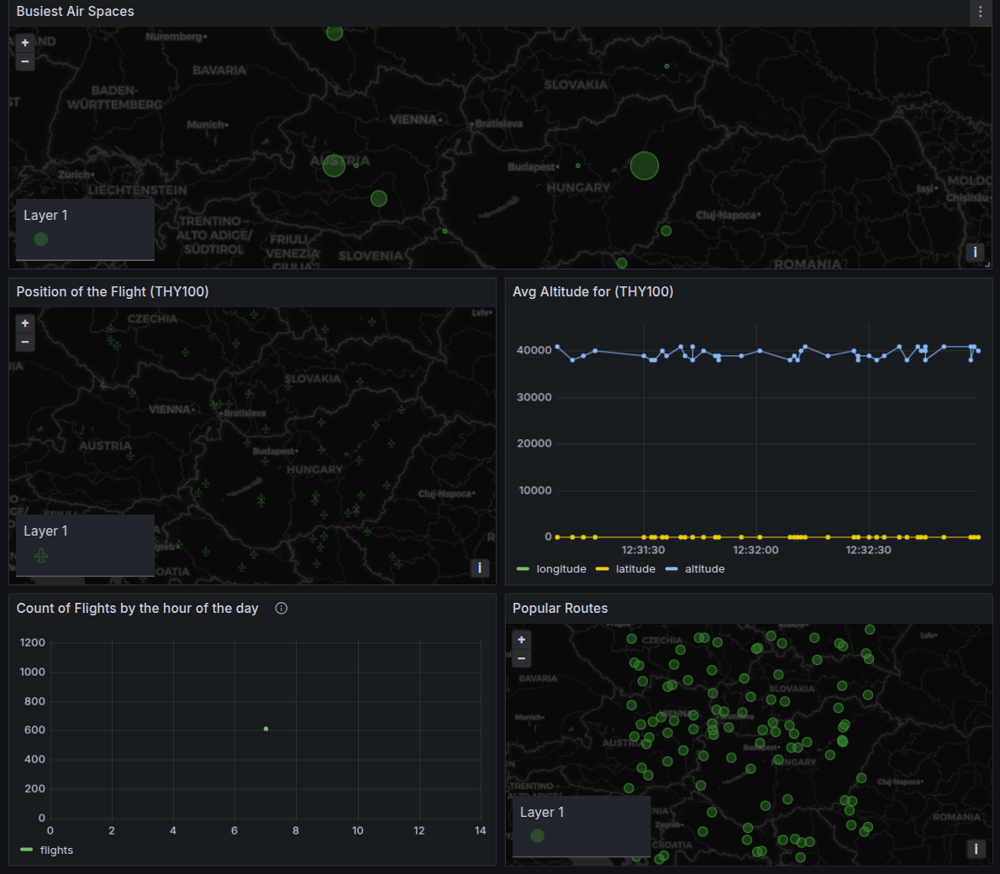

# High level flow



# Prerequisites

## Credentials

| Service    | Username | Password |
|------------|----------|----------|
| Airflow    | admin    | admin    |
| ClickHouse | default  | admin    |

---

### Getting Started

All services are containerized and can be started using `docker-compose`.

```sh
# Prerequisites:
# - Docker and Docker Compose should be installed
# - Clone the repository
# Start all services
make start
```

# Kafka-Airflow-ClickHouse-NiFi Stack - README

This project sets up a complete data pipeline ecosystem using Docker Compose, including Kafka, Airflow, ClickHouse,
NiFi (optional), and supporting tools. Below is a breakdown of each service and its role in the architecture.

---

## Services

- **Flight Mock Service**
    - **Build:** `Dockerfile-mock`
    - **Purpose:** Simulates flight data by generating mock flight events.
    - Its a FAST API service that generates random flight data.
    - In this case I am using SSE (Server-Sent Events) to stream the data to the producer.
    - However, this will allow only 1 way communication(server to client).
    - In production system, I would use web sockets or gRPC for 2 way communication.
    - Reason for two-way communication is that I need to get data based on offsets in case of failures.

- **Flight Producer**
    - **Build:** `Dockerfile-producer`
    - **Purpose:** Sends mock flight data to Kafka with Avro serialization.
    - **Features:**
        - Serializes the data and conforms to the schema in the schema registry.
        - Uses `confluent-kafka-python` for Kafka producer.

- **Kafka**
    - **Image:** `confluentinc/cp-kafka`
    - **Purpose:** Message broker to handle real-time event streaming between producers and consumers.

- **Schema Registry**
    - **Image:** `confluentinc/cp-schema-registry`
    - **Purpose:** Enforces Avro schemas for Kafka messages, ensuring consistency.

- **Kafka REST Proxy**
    - **Image:** `confluentinc/cp-kafka-rest`
    - **Purpose:** HTTP interface to interact with Kafka topics. Used by the producer.

- **Kafka UI**
    - **Image:** `provectuslabs/kafka-ui`
    - **Purpose:** Web UI for managing Kafka – topics, consumers, etc.

- **ClickHouse Server**
    - **Image:** `clickhouse/clickhouse-server`
    - **Purpose:** OLAP database for fast analytics on large volumes of data.

- **Apache NiFi**
    - **Image:** `apache/nifi`
    - **Purpose:** Low-code data ingestion and transformation tool (optional in pipeline).
    - **Note:** NiFi is optional and can be used for more complex data flows or transformations.
    - **Features:**
        - Provides a web-based UI for designing data flows.
        - Can be used to route, transform, and process data in real-time.
    - I was hoping to use this service to create a data flow that would take the data from Kafka and push it to
      ClickHouse.
    - This is an alternate to the producer service for ingestion to kafka.

- **PostgreSQL**
    - **Image:** `postgres:13`
    - **Purpose:** Metadata DB for Airflow (can be reused for transactional needs).

- **Airflow Init**
    - **Image:** `apache/airflow`
    - **Purpose:** Initializes Airflow DB and admin user.

- **Airflow Scheduler**
    - **Image:** `apache/airflow`
    - **Purpose:** Executes DAG tasks based on scheduling.
    - At the moment, all this is doing is to check if the producer service is up or not, if not it triggers an email
      and restarts the service.
    - Runs every 1 minute.
    - **Additional Features to incorportate:**
        - To add a dag that checks for missing data in kafka due to producer failure/lags and reprocesses that data
          into kafka based on offsets while logging and notifying the user.

- **Airflow Webserver**
    - **Image:** `apache/airflow`
    - **Purpose:** UI to monitor and manage DAGs.

- **Zookeeper**
    - **Image:** `confluentinc/cp-zookeeper`
    - **Purpose:** Required by Kafka to manage brokers and metadata.

## Summary

This stack provides a powerful end-to-end data platform:

- Ingest mock flight data via producers
- Stream through Kafka
- Process via Airflow
- Store/analyze in ClickHouse
- Orchestrate flows using NiFi

Useful for prototyping real-time and batch data pipelines in a controlled local setup.

# Testing

For testing Failures in airflow, you can stop the producer service and see how the DAG fails.

```sh
docker stop assignment_2-flight-producer-1
```

# Analytics

1. Below query shall in realtime give the top 10 busiest air spaces

```sql
SELECT 
lon_grid_materialized AS lon_grid,
lat_grid_materialized AS lat_grid,
count() AS flight_count
FROM flight_data.flight_positions
WHERE timestamp >= now() - INTERVAL 1 HOUR
GROUP BY lon_grid, lat_grid
HAVING flight_count > 0
ORDER BY flight_count DESC
LIMIT 10;
```

2. Tracking specific flights over time

- Latest position for a specific flight by callsign

```sql
SELECT *
FROM flight_data.flight_positions
WHERE callsign = 'FDB892'
ORDER BY timestamp DESC
LIMIT 1;
```

- Flight path for a specific flight

```sql
SELECT 
    timestamp,
    longitude,
    latitude,
    altitude
FROM flight_data.flight_positions
WHERE callsign = 'FDB892'
ORDER BY timestamp;
```

- Current flights in a specific area (real-time bounding box)

```sql
SELECT 
    flight_id,
    callsign,
    altitude,
    gspeed,
    timestamp
FROM flight_data.flight_positions
WHERE 
    longitude BETWEEN -122.5 AND -122.3 AND
    latitude BETWEEN 37.7 AND 37.9 AND
    timestamp >= now() - INTERVAL 5 MINUTE
ORDER BY timestamp DESC;

```

3. Flight Patterns

    - At what hour there are most flights in the air

```sql
SELECT 
    hour,
    count() AS flights
FROM flight_data.flight_positions
WHERE date BETWEEN today() - 7 AND today()
GROUP BY hour
ORDER BY hour;
```

- Average altitude by hour of day

```sql

SELECT 
    hour,
    avg(altitude) AS avg_altitude
FROM flight_data.flight_positions
WHERE date BETWEEN today() - 30 AND today()
GROUP BY hour
ORDER BY hour;
```

- Flight path frequency (popular routes)

```sql
SELECT
    geoToH3(longitude, latitude, 7) AS h3_cell,
    count() AS frequency
FROM flight_data.flight_positions
WHERE date BETWEEN today() - INTERVAL 30 DAY AND today()
GROUP BY h3_cell
ORDER BY frequency DESC
LIMIT 100;
```

- Seasonal flight pattern changes (monthly comparison)
- For this Ideally i will load the data into another table with partitioning as monthly and then run the below query
- And the same view which is optimized for real-time query need not be used to run this query.
- I will have a airflow job which takes data from the real-time table and loads it into the monthly
  partitioned table, and remove the partitions from the real-time table.

```sql
SELECT 
    toMonth(timestamp) AS month,
    count() AS flight_count
FROM flight_data.flight_positions
WHERE timestamp >= now() - INTERVAL 1 YEAR
GROUP BY month
ORDER BY month;
```

# High level dashboard:



# Scope for improvements

1. Better use of materialized views in clickhouse to feed into more analytical queries
2. Per the pointers mentioned against each service, need to build a fall back mechanism to failures and delays:
    - For example, if the producer service fails, we need to have a way to reprocess the data from the last known
      offset.
    - This has to be done at the ingester level. That service needs to be more robust and should be able to handle
      failures with a backend stateful system to keep track of the offsets.
    - Or Explore Nifi if the above can be made possible
3. The source data in the bronze layer, I am loading into kafka, but i might want to load the backup data somewhere,
   if the retention period is over in kafka.
4. Basically a lot of optimizations can be done in terms of Disaster recovery, HA, and scaling.
5. I wanted to put graphana/evidence.dev into this repo as IAAC but I ran out of time.